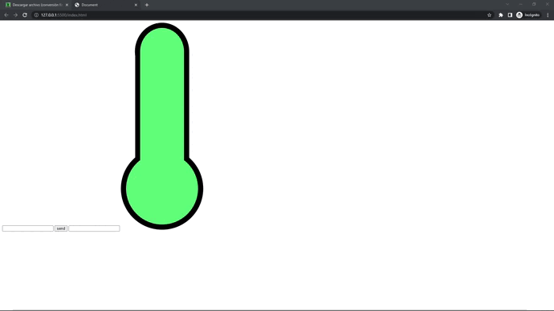

# Titulo del proyecto

## Inpiracion del proyecto & objetivo

-  ejercicio de programacion en  JavaScript

## Tecnologias usadas

- Ide
    <!-- visual studio code -->
    <code></code>

- Programas usados
    <!-- figma -->
    <code></code>
- lenguajes/frameworks usados
    <!-- bootstrap -->
    <code></code><!-- css -->
    <code></code><!-- javascript -->
    <code></img></code>
## Vista previa del proyecto

</img>

## Estado del proyecto

|Trabajando en el proyecto|✔️|
| -------------------------- | :----------------: |
|            Web responsive  |      ❌        |
|           Hosting          |    |
| Websever app online        |         ❌    |  
| Dispone de trello          |         ❌    |  
<details open>
<summary>⚙️ documentacion del proyecto ⚙️</summary>

1. Se introducen los datos
   ```js
           function temp() {
            // 1. obten el valor del input
            input = window.prompt("Ingrese la temperatura");
        }
   ```
2. Se procesas el valor del input y se cambia la imagen de la temperatura
   ```js
            if (input <= 15) {
                document.getElementById("temp-image").src = "img/cold.png";
                console.log("frio");
            }
            if (input > 15) {
                document.getElementById("temp-image").src = "img/good.png";
                console.log("bien");

            }
            if (input >= 30) {
                document.getElementById("temp-image").src = "img/hot.png";
                console.log("calor");
            }
   ```
3. Se muestra el resultado
   ```js
        function temp() {
            // 1. obten el valor del input
            input = window.prompt("Ingrese la temperatura");
            // 3. imprime el valor en el output
            document.getElementById("temp-output").value = input;
        }
   ```

</details>

<!-- └── / ├── │ -->


## Licencia

``no disponible``
